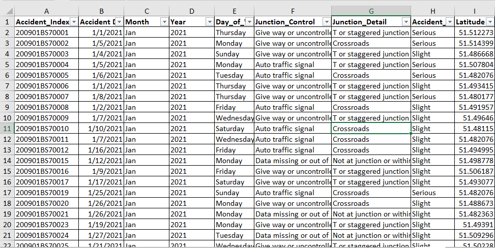

# Road_Accident_dashboard

## Introduction
### An overview of the Road Accident Dashboard [2020-2021]. The primary objective is to identify fatal casualties by vehicle type and analyze trends in casualties over the current and previous year. This analysis aims to provide valuable insights to inform safety decisions and strategies for road accident prevention and mitigation.
**_Disclaimer: All dataset and report do not represent any institution or organization but just a dummy dataset to demonstrate the capabilities of Microsoft Excel_**
## Problem Statement
- Primary KPI- Total casualties taken place after the accident
- Primary KPI's - Total casualties and percentage of total with respect to accident severity and maximum casualties by type of vehicle
- Secondary KPI's - Total casualties with respect to vehicle type
- Monthly trend showing comparision of casualties for current year and previous year
- Maximum casualties by road type
- Distribution of total casualties by road surface
- Relation between casualties by Area/Location & by Day/Night.
## Skill/Concept demonstrated
- Data Cleaning
- Data Processing
- Data Analysis
- Data Visualization
- Report/Dashboard
## Problem Approach
- I clean, remove duplicate and empty rows from the dataset
- I created pivot chart to answer each question
- I created an executive slicer to enable stakeholder filter each region
- I transformed raw dataset from Excel files and designed interactive reports and dashboards to complete the task.

Raw Dataset Given                  | Cleaned Dataset Ready for Analysis
|----------------------------------|------------------------------------|
               |       
## Stakeholders
- Ministry of Transport
- Road Transport Department
- Police Force
- Emergency Service Department
- Road Safety Corp
- Public
- Media
## Insight and Analysis
Below are the  Insight derived from the analysis

